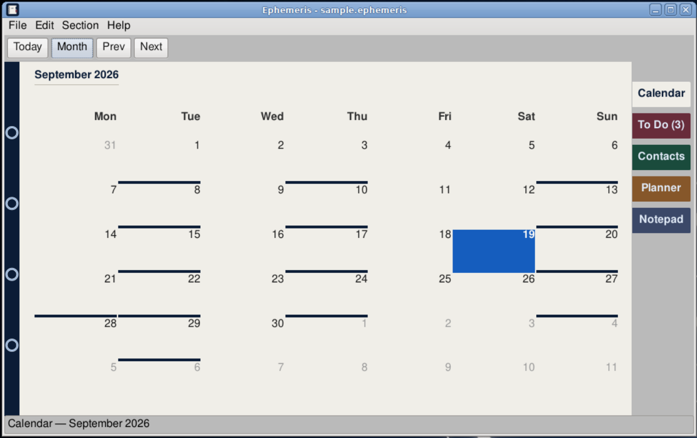
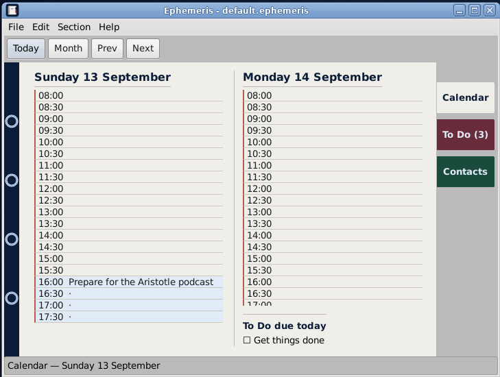
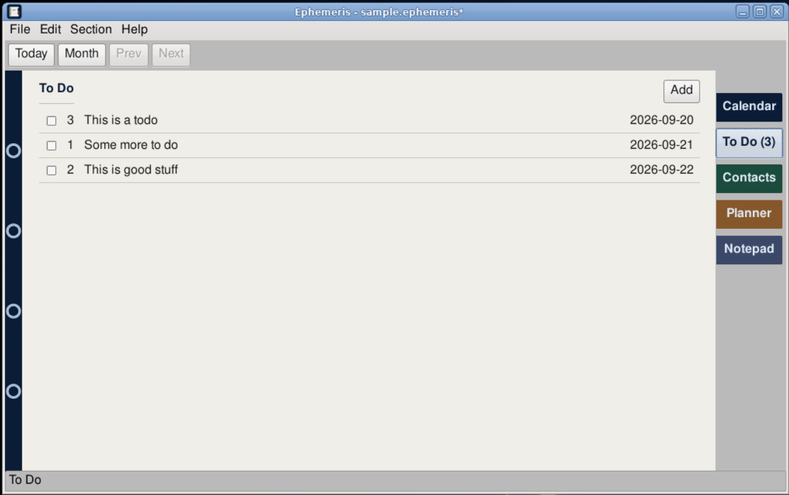
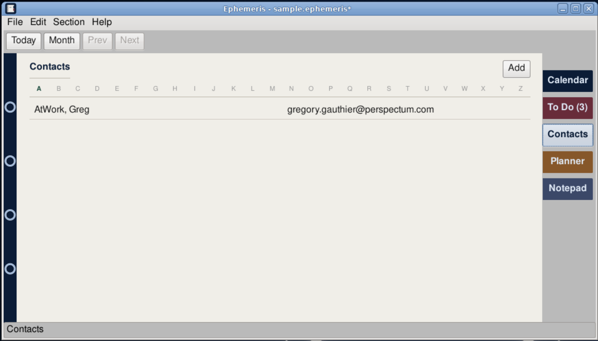
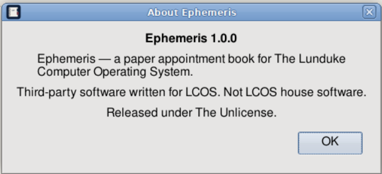

# Ephemeris

**Vended by Grok Build**



A **paper appointment book** for The Lunduke Computer Operating System (LCOS). The window is Lotus Organizer, not Outlook.

Binary: `ephemeris`. Unlicense.

LCOS itself: [https://github.com/BryanLunduke/LCOS](https://github.com/BryanLunduke/LCOS)









## Status

**v1.0.0.** Planner, recurrence, Notepad, vCard, and HTTPS iCalendar subscribe. See [INSTALL.md](INSTALL.md).

| Doc | What |
|---|---|
| [DEVELOPMENT.md](DEVELOPMENT.md) | Locked decisions, architecture, milestones M0–M5, branching, semver, lint |

## Build

```
sudo apt install build-essential meson ninja-build pkg-config g++ libgtkmm-3.0-dev libxml2-dev libsoup-3.0-dev clang-format cppcheck
meson setup build
meson compile -C build
./build/ephemeris
```

PR lint gate: `./scripts/lint.sh` (CI runs this; no `--fix`). Format `src/` locally with `./scripts/lint.sh --fix`.

Install: [INSTALL.md](INSTALL.md).

## License

[The Unlicense](https://unlicense.org). See [UNLICENSE](UNLICENSE).
