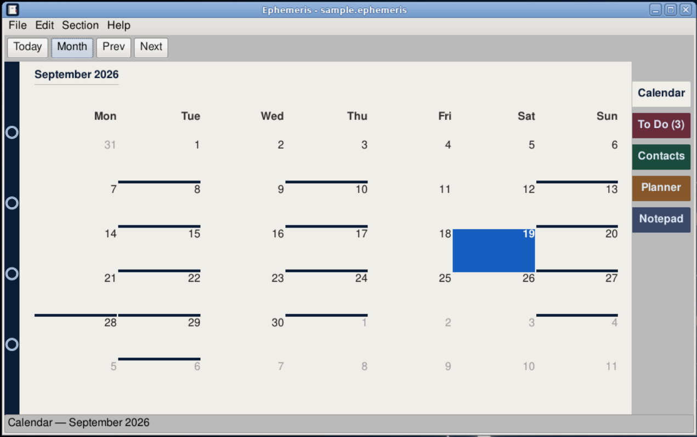
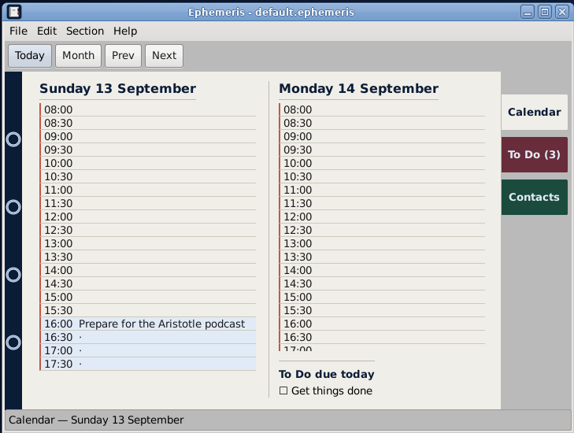
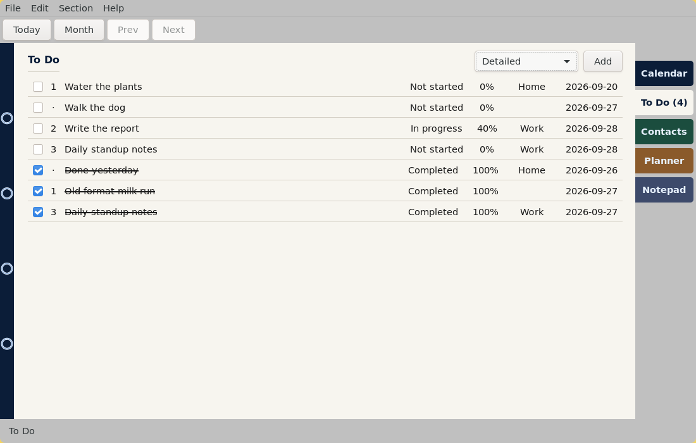
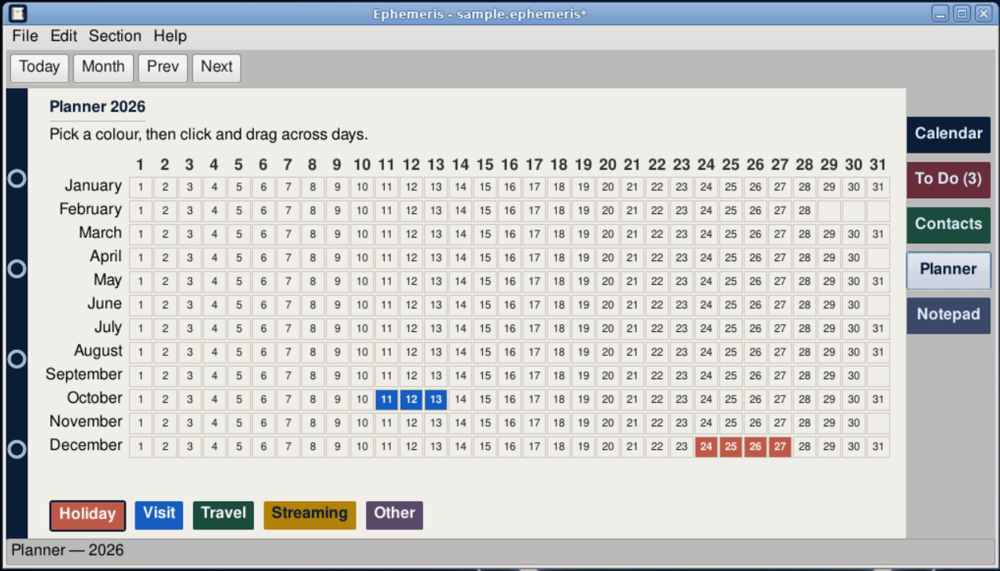
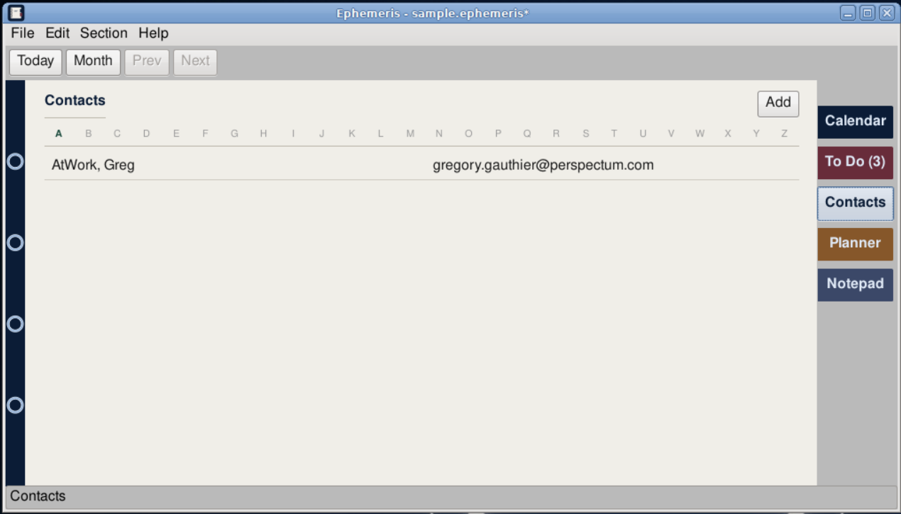
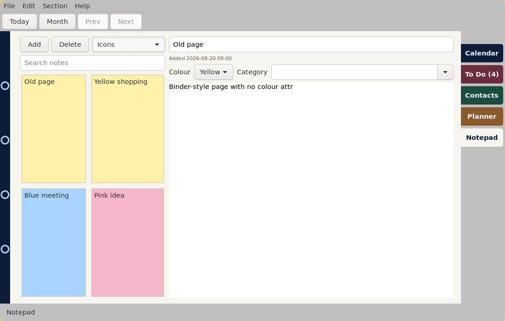
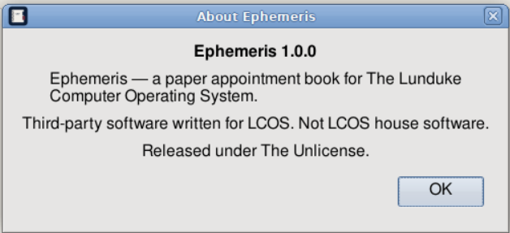

# Ephemeris

**Vended by Grok Build**



A **paper appointment book** for The Lunduke Computer Operating System (LCOS). The window is Lotus Organizer, not Outlook.

Binary: `ephemeris`. Unlicense.

LCOS itself: [https://github.com/BryanLunduke/LCOS](https://github.com/BryanLunduke/LCOS)













## Status

**v1.2.0.** Notepad journal dates, rich text, and a category list. **v1.1.22.** A lower-case vCard envelope opens the card. **v1.1.21.** A contact with a phone or an email and no name is kept. **v1.1.20.** Notepad's last seven days are today and the six days before it. **v1.1.19.** The next-seven-days list is today and the six days after it. A planner day is painted with the later event, and that event can be opened. Each appointment on the day grid opens from the slot where it starts. A refresh that is not a calendar leaves the saved calendar in place. Text that does not parse leaves the previous start, due, or until in place. A day the month does not have, such as 31 February, is rejected. Completing a monthly or yearly to-do keeps that day. A vCard that has only a phone number is kept. A semicolon inside a vCard N field round-trips. A grouped vCard phone or email is kept. iCalendar names match without regard to case. A property name keeps its value when the line carries parameters. A monthly or yearly day the month does not have is skipped. Weekly BYDAY expands in weekday order. Unbounded daily events that started long before the window stay visible. Multi-day all-day events are drawn on each covered day. Timed events that cross midnight are drawn on each covered day. Monthly and yearly BYDAY, including ordinals. Outlook-class To Do fields and views; Notepad colour, categories, list views, and search. Headless test suite and BUG-BACKLOG.md. See [INSTALL.md](INSTALL.md).

| Doc | What |
|---|---|
| [DEVELOPMENT.md](DEVELOPMENT.md) | Locked decisions, architecture, milestones M0–M5, branching, semver, lint |

## Build

```
sudo apt install build-essential meson ninja-build pkg-config g++ libgtkmm-3.0-dev libxml2-dev libsoup-3.0-dev clang-format cppcheck
meson setup build
meson compile -C build
./build/ephemeris
```

PR lint gate: `./scripts/lint.sh` (CI runs this; no `--fix`). Format `src/` locally with `./scripts/lint.sh --fix`.

Install: [INSTALL.md](INSTALL.md).

## License

[The Unlicense](https://unlicense.org). See [UNLICENSE](UNLICENSE).
